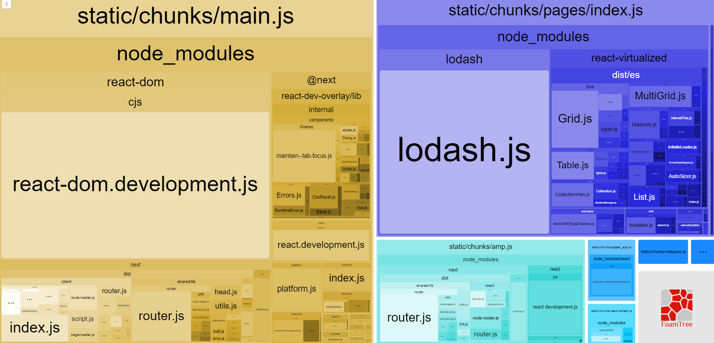

<h1 align="center"></h1>

<h3 align="center">Performance Optimization Techniques for React Apps</h3>

<p align="center">“Software developers are students forever 🧠”</p>

<p align="center">
  <a href="#about">Sobre</a>&nbsp;&nbsp;&nbsp;|&nbsp;&nbsp;&nbsp;
  <a href="#description">Descrição</a>&nbsp;&nbsp;&nbsp;|&nbsp;&nbsp;&nbsp;
  <a href="#install">Instalação</a>&nbsp;&nbsp;&nbsp;|&nbsp;&nbsp;&nbsp;
  <a href="#challenge">Desafios</a>&nbsp;&nbsp;&nbsp;|&nbsp;&nbsp;&nbsp;
  <a href="#technologies">Tecnologias</a>
</p>

## :speech_balloon: Sobre <a name="about"></a>

> Essa aplicação foi construída para aprender algumas técnicas de performance do React.
>
> Uma nova renderização tem o seguinte fluxo:
>
> 1. O React gera uma nova versão do componente que precisa ser "renderizado".
> 2. Compara essa nova versão com a versão anterior já salva na página.
> 3. Se houverem alterações, o React "renderiza" essa nova versão em tela.
>
> Também ocorrem de três formas:
>
> 1. **Pai para filho:** quando o componente PAI sofre alteração, o componente FILHO será atualizado.
> 2. **Propriedade:** quando uma propriedade atualiza.
> 3. **Hooks:** useState, useContext, useReducer, entre outros...

## :speech_balloon: Descrição <a name="description"></a>

> **Memo:** Técnica utilizada para performar componentes. Não deixa atualizar a renderização.
>
> Trás alguns benefícios quando utilizado em:
>
> - Componentes puros.
> - Componentes que renderizam muito.
> - Quando um componente renderiza com as mesmas props.
> - Quando o projeto está de médio para grande.

> **useMemo:** É uma forma para performar algo complexo (geralmente cálculos) dentro da aplicação.
>
> Dois casos de uso são:
>
> - Cálculos pesados.
> - Igualdade referencial (quando passa uma informação a um componente filho).

> **useCallback:** Usado para igualdade referencial de funções. Utilizado geralmente quando se tem prop drilling. Também deve-se transformar a função em uma constante.

```bash
const addToWishlist = useCallback(async (id: number) => {
    console.log(id);
  }, []);
```

<br />
<table>
  <tr>
    <td colspan="1">Bundle Analyzer</td>
  </tr>
  <tr>
    <td></td></td>
  </tr>
</table>

## :warning: Instalação <a name="install"></a>

```bash
# Instalar as dependências necessárias:
$ yarn

# Iniciar o servidor:
$ yarn server

# Iniciar o projeto:
$ yarn dev

```

## :triangular_flag_on_post: Desafio <a name="challenge"></a>

> Aplicabilidade das técnicas apresentadas acima.

## :heavy_check_mark: Tecnologias <a name="technologies"></a>

- [ReactJS](https://pt-br.reactjs.org/)

---

by [Douglas Scaini](https://www.github.com/douglasscaini) ❤️
